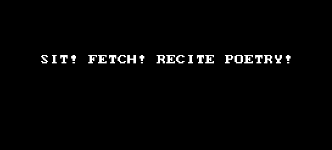

# Poetic Dog
A node app which posts to your chosen channel, built using Slack's Bolt framework

## Rationale & Spec
A light-hearted addition to our company workspace's **Dogs** channel. Dogs are trained to respond to a command word like 'sit' or 'fetch' or 'stay'. The dog/bot I have in mind is a cultured creature and responds to the word 'recite'. 
The app is hosted on Heroku. Poetic Dog is installed on our company Slack workspace and the word 'recite' is listened for. When it is heard, Poetic Dog responds with a light-hearted haiku about the relationship between dog and human. Here is a gif of it in action to show It Just Works TM:

## Forking and using Poetic Dog for your own workspace
### NOTE: only relevant whilst app is in single-workspace mode (before publishing to global Slack App Marketplace)
You should fork this repository and go through authentication steps as described in Tutorial 1 below as well as follow Slack's app token sharing guide. In short, you will be generating a `SIGNING_SECRET` and `BOT_TOKEN` , adding them to your host, and enabling incoming webhooks. 

## Sources of information and inspiration
There are a number of independent tutorials out there along with API documentation and guides on Slack's own website. Here are a list of resources I have found useful when learning about NodeJS and Slack bots:

 - Slack API [documentation](https://api.slack.com/apis/connections/events-api)
 - [tutorial 1](https://www.freecodecamp.org/news/building-a-slackbot-with-node-js-and-slackbots-js/)
 - Slack OAuth [guide](https://api.slack.com/authentication/oauth-v2#exchanging) for expansion beyond one single Slack workspace

## A wishlist for the future of this repository

 - expand the number of commands that Poetic Dog can respond to. 
 - develop a database solution and open up poetry for submissions
 - implement Slack's OATH procedure
 - publish the app on the Slack App Marketplace, allowing anyone to use it

